# Transaction Repository Sync Workflow

This document explains how `TransactionRepository` works in
`lib/transactions/repositories/transaction_repository.dart`.

It covers:
- how reads work
- how add/update/delete work
- what happens online vs offline
- how sync behaves in success and failure scenarios
- how the repository interacts with local storage, remote storage, and sync orchestration

---

## Overview

`TransactionRepository` is an offline-first repository.

That means:
- local storage is the immediate source of truth
- writes succeed locally before any network work is required
- sync is attempted in the background when connectivity is available
- failed sync does not block local writes
- failed sync leaves records dirty so they can be retried later

The repository coordinates:
- `TransactionLocalSource`
- `TransactionRemoteSource`
- `RepositorySyncExecutor`
- `ConnectivityService`

---

## Main Components

### `TransactionLocalSource`
- reads and writes transactions in Drift/SQLite
- powers `getAll`, `getById`, and `watchAll`
- stores sync flags like `isDirty`, `isDeleted`, `remoteId`, and `lastSynced`

### `TransactionRemoteSource`
- creates, updates, deletes, and fetches records from PocketBase
- is only used during sync

### `RepositorySyncExecutor`
- checks connectivity before sync
- runs the sync phases in order
- collects failures across all phases
- throws `RepositorySyncException` if any sync work failed

### `ConnectivityService`
- tells the repository whether the device is online
- allows background sync to skip safely when offline

---

## High-Level Mental Model

The repository follows this pattern:

1. Save locally first.
2. Return control to the caller quickly.
3. Attempt sync only if online.
4. Keep failed records dirty.
5. Let later sync attempts retry them.

---

## High-Level Data Flow

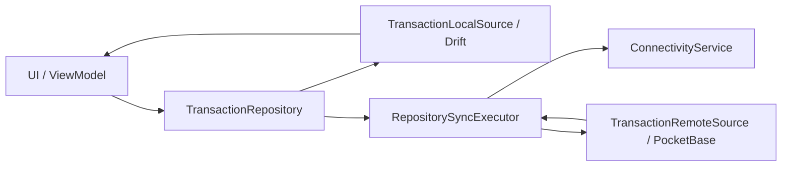

---

## Read Workflows

## `getAll({forceRefresh = false})`

### Behavior
- if `forceRefresh` is `false`, the repository reads only from local DB
- if `forceRefresh` is `true`, it syncs first, then returns local DB results
- even after refresh, the final response still comes from local DB

### Why this is useful
- local DB stays the single read source
- UI gets consistent results
- sync updates local storage first, then reads from it

### Diagram

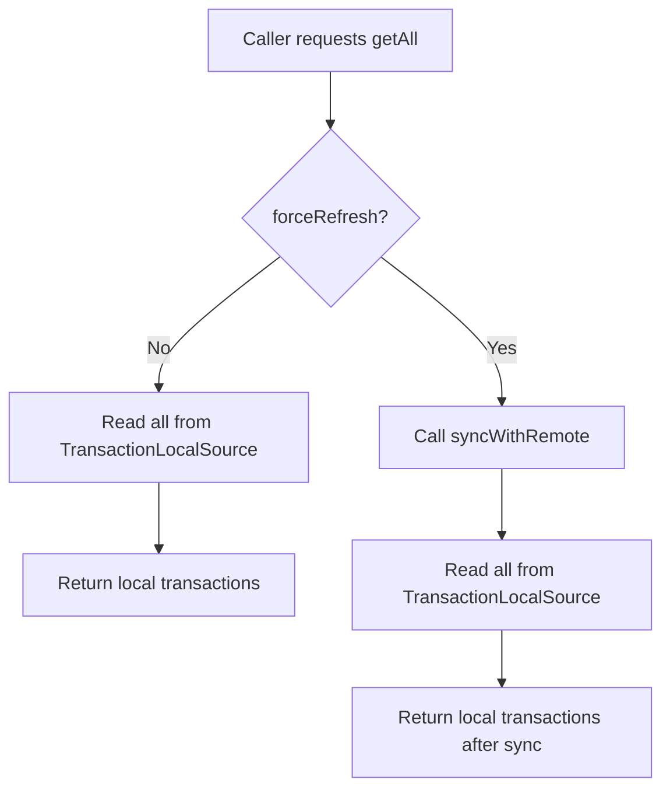

### Online refresh case
- `syncWithRemote()` runs
- dirty items are pushed
- deleted items are pushed
- remote items are pulled and merged
- updated local data is returned

### Offline refresh case
- `syncWithRemote()` exits early without throwing
- repository still returns current local cache

---

## `getById(id)`

### Behavior
- looks only in local DB
- no remote request is made
- returns transaction or `null`

### Diagram

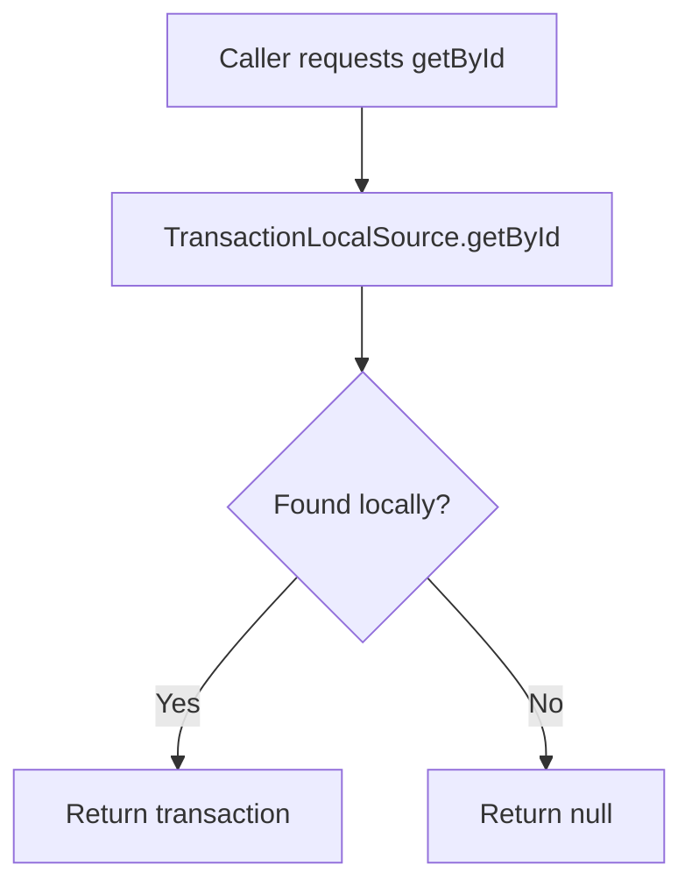

### Why this is useful
- very fast
- works offline
- avoids network dependency for detail views

---

## `watchAll()`

### Behavior
- returns the local Drift stream directly
- UI reacts to local changes only

### Diagram

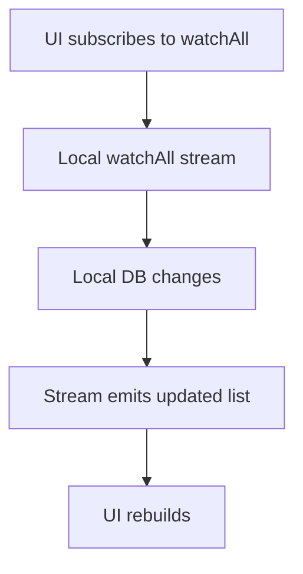

### Why this matters
When sync later updates local records:
- the stream emits again
- the UI updates automatically
- the UI does not need direct knowledge of sync internals

---

## Write Workflows

## `add(transaction)`

### What the repository does
1. creates a copy of the input with:
   - `isDirty: true`
   - `version: 1`
2. inserts that copy into local DB
3. returns the saved transaction immediately
4. starts background sync through `RepositorySyncExecutor`

### Diagram

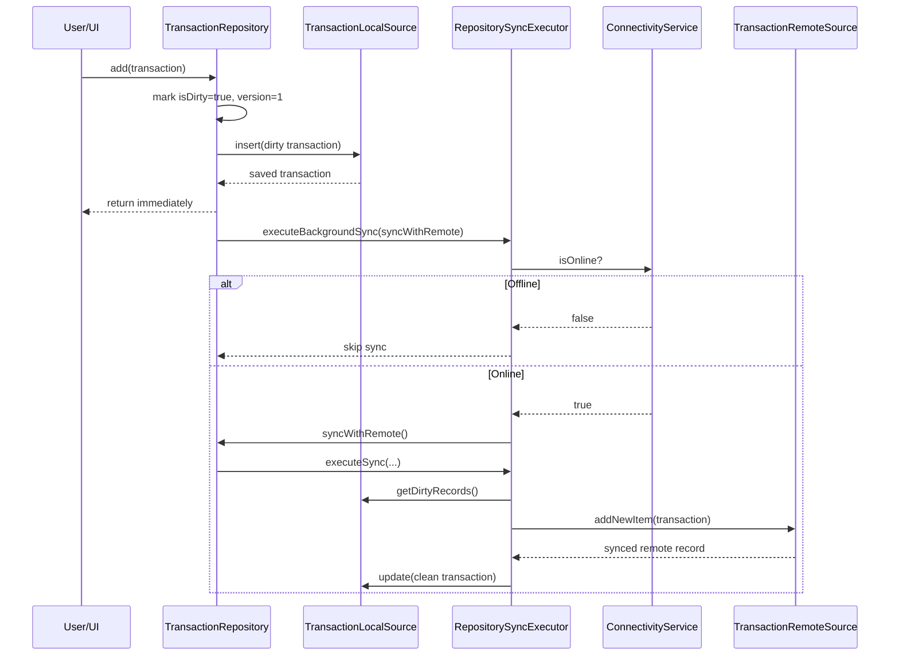

### Online case
- local insert succeeds immediately
- background sync starts
- remote create succeeds
- local row is updated with:
  - `isDirty: false`
  - `lastSynced: now`
  - synced remote values returned by the backend

### Offline case
- local insert still succeeds immediately
- sync executor sees no connectivity
- sync is skipped safely
- transaction stays dirty for later retry

### User-visible result
- the new transaction appears immediately from local DB
- it can sync later without blocking the user flow

---

## `update(transaction)`

### What the repository does
1. creates an updated copy with:
   - `isDirty: true`
   - `version: currentVersion + 1`
2. writes it to local DB
3. starts background sync

### Diagram

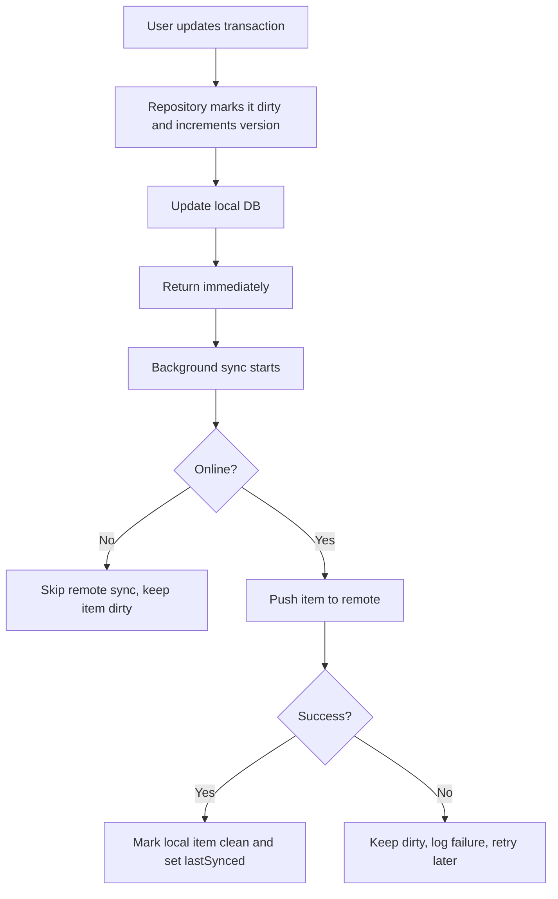

### Important behavior
- local changes are never blocked by temporary network failure
- dirty state is what preserves eventual consistency

---

## `delete(id)`

### What the repository does
1. calls `TransactionLocalSource.softDelete(id)`
2. local source marks the row:
   - `isDeleted: true`
   - `isDirty: true`
3. repository starts background sync
4. during sync:
   - dirty push skips deleted rows
   - deleted push handles remote delete
   - local hard delete happens only after delete phase succeeds

### Diagram

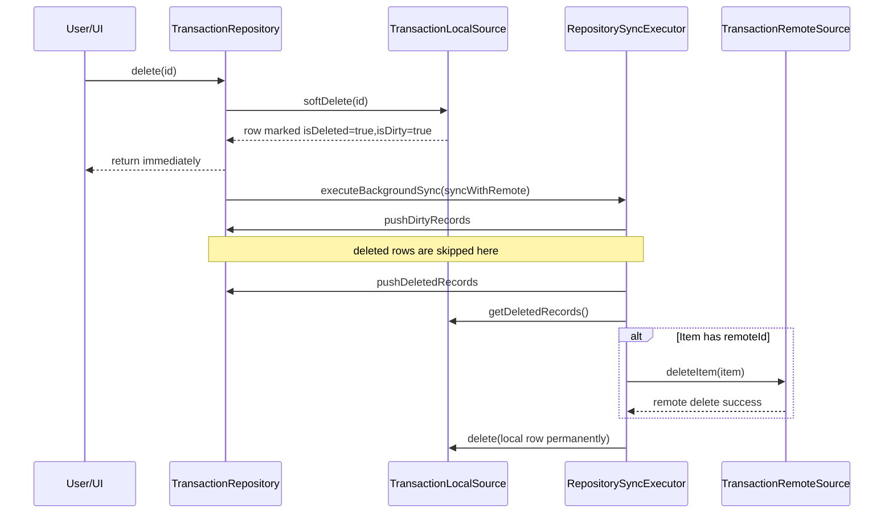

### Offline delete case
- row is soft-deleted locally
- it disappears from normal visible lists
- remote delete is deferred until later

### Why this is safe
The app behaves as deleted immediately, but the record is still preserved locally until remote delete is handled.

---

## Full Sync Workflow

## `syncWithRemote()`

This is the explicit full sync entry point.

It delegates to `RepositorySyncExecutor.executeSync(...)`.

### Sync phases
1. connectivity check
2. push dirty non-deleted records
3. push deleted records
4. pull remote records and merge
5. throw aggregate sync error if any failures happened

### Diagram

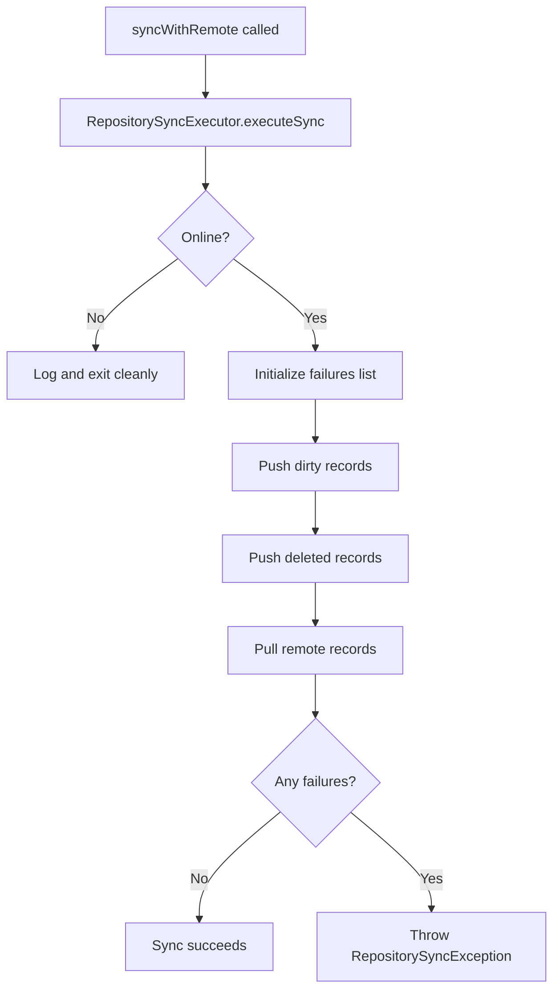

---

## Phase 1: Push Dirty Records

### Rules
For each dirty transaction:
- if `isDeleted == true`, skip it in this phase
- if `remoteId != null`, update existing remote record
- otherwise, create new remote record
- if successful:
  - update local record with synced result
  - mark `isDirty: false`
  - set `lastSynced`
- if failed:
  - log warning
  - add failure entry
  - continue with the next record

### Diagram

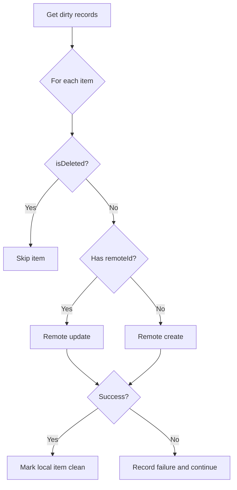

### Important consequence
One bad item does not stop the whole sync pass.

---

## Phase 2: Push Deleted Records

### Rules
For each deleted transaction:
- if `remoteId != null`, delete it remotely first
- then delete it locally
- if remote delete fails:
  - local record is kept
  - failure is collected
  - later sync can retry

### Diagram

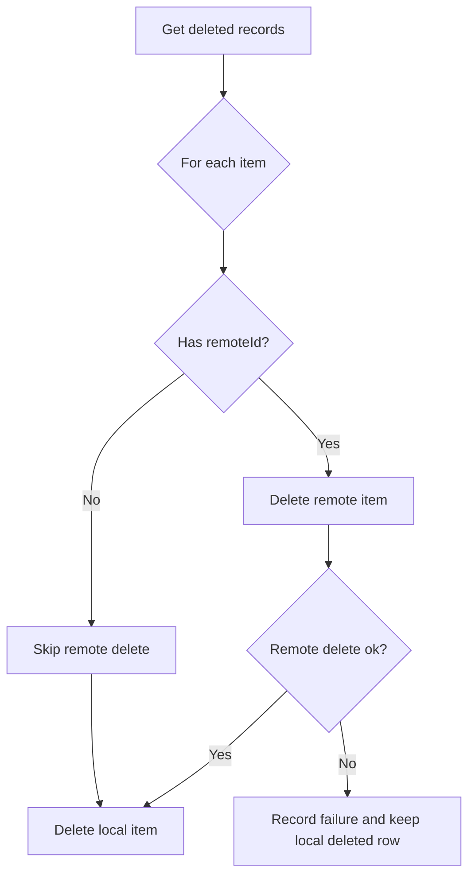

---

## Phase 3: Pull Remote Records

### Rules
For each remote item:
- read local item with the same ID
- if local item does not exist:
  - insert remote item locally
- if local item exists and is not dirty:
  - replace local with the remote version
  - update `lastSynced`
- if local item exists and is dirty:
  - do not overwrite it

### Diagram

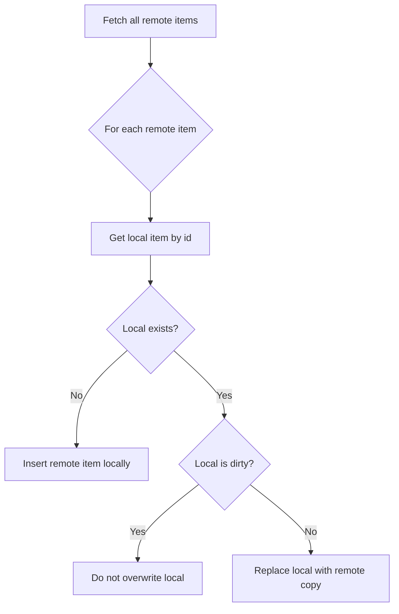

### Why dirty local rows are protected
This prevents unsynced local changes from being overwritten by older or conflicting remote data.

---

## Important Scenarios

## Scenario A: User adds a transaction while online

### What happens
- item is inserted locally as dirty
- background sync starts
- remote create succeeds
- local row is updated to clean
- UI can receive another local stream update with synced values

### Result
- fast UX
- remote sync completed
- no dirty backlog remains for that item

---

## Scenario B: User adds a transaction while offline

### What happens
- item is inserted locally as dirty
- background sync checks connectivity
- sync is skipped
- item remains dirty

### Result
- user still sees the transaction immediately
- nothing is lost
- later sync can upload it

### Diagram

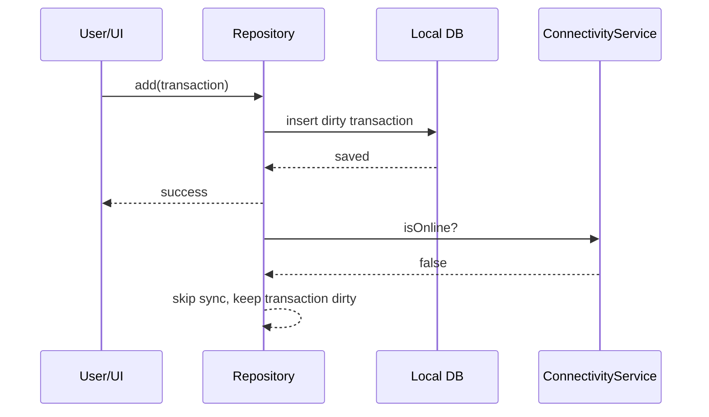

---

## Scenario C: User requests all transactions without refresh

### What happens
- repository reads only local DB
- no network call happens

### Result
- fastest path
- always works offline

---

## Scenario D: User requests all transactions with refresh

### Online
- full sync runs
- local DB is updated from remote
- local list is returned

### Offline
- sync exits safely
- current local list is returned

### Result
- callers always receive local data
- online refresh improves local freshness

---

## Scenario E: User requests one transaction by ID

### What happens
- repository checks local DB only
- returns item or `null`

### Result
- deterministic
- offline-safe

---

## Scenario F: Partial sync failure

Example:
- 3 dirty items exist
- first push fails
- second and third succeed

### What happens
- sync continues across all items
- successful items are cleaned
- failed item stays dirty
- failure is added to the failure list
- at the end, repository throws `RepositorySyncException`

### Diagram

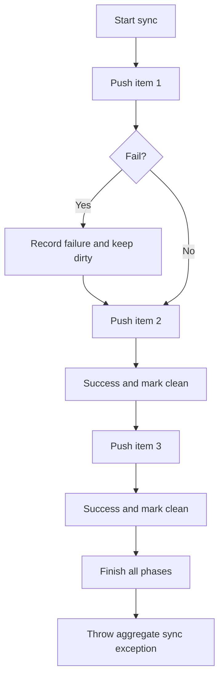

### Why this design is good
It provides both:
- maximum progress
- reliable retry signaling for orchestration

---

## Scenario G: Pulled remote item matches a dirty local item

### What happens
- remote item is fetched
- local item exists
- local item is dirty
- repository does not overwrite local item

### Result
- unsynced local change is preserved
- future sync can resolve it naturally through push behavior

---

## Scenario H: User deletes while offline

### What happens
- item is soft-deleted locally
- it disappears from visible lists because `getAll()` filters deleted rows
- remote delete is deferred

### Result
- UI behaves immediately as expected
- eventual sync still remains possible

---

## How the UI experiences all this

The UI usually interacts through:
- `getAll()`
- `getById()`
- `watchAll()`
- `add()` / `update()` / `delete()`

Because reads and reactive updates come from local DB:
- UI updates immediately after local writes
- UI also updates later when sync modifies local rows
- UI does not have to wait for network success to feel responsive

---

## Relationship to `SyncOrchestrationService`

`TransactionRepository` does:
- local-first persistence
- best-effort background sync on write
- explicit full sync with aggregate failure throwing

`SyncOrchestrationService` does:
- call `syncWithRemote()` when needed
- catch repository-level sync failures
- retry with backoff
- surface sync state and notifications

### Diagram

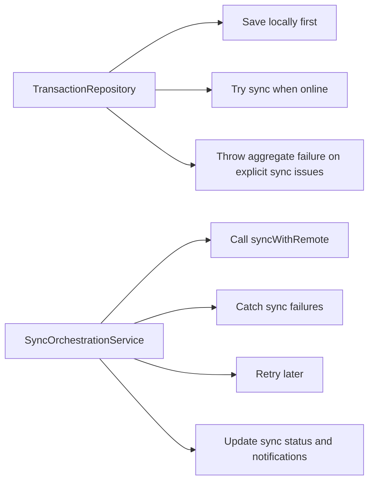

---

## Summary Table

| Method | Local DB | Remote | Offline Support | Immediate Return | Can Throw |
|---|---|---|---|---|---|
| `getAll()` | Read | No unless `forceRefresh` | Yes | Yes | Only if forced online sync fails |
| `getById()` | Read | No | Yes | Yes | No |
| `watchAll()` | Stream | No | Yes | Yes | No |
| `add()` | Insert dirty | Background if online | Yes | Yes | Only local persistence failure |
| `update()` | Update dirty | Background if online | Yes | Yes | Only local persistence failure |
| `delete()` | Soft-delete dirty | Background if online | Yes | Yes | Only local persistence failure |
| `syncWithRemote()` | Read/write local | Yes | Yes, skips when offline | N/A | Yes, aggregate sync failure |

---

## Final Mental Model

Think about `TransactionRepository` this way:

1. local DB gives the app immediate responsiveness
2. dirty flags remember what still needs syncing
3. connectivity decides whether sync happens now or later
4. sync works in three phases: push dirty, push deleted, pull remote
5. failures do not lose data; they create retryable work

That is the core of the repository's offline-first behavior.
